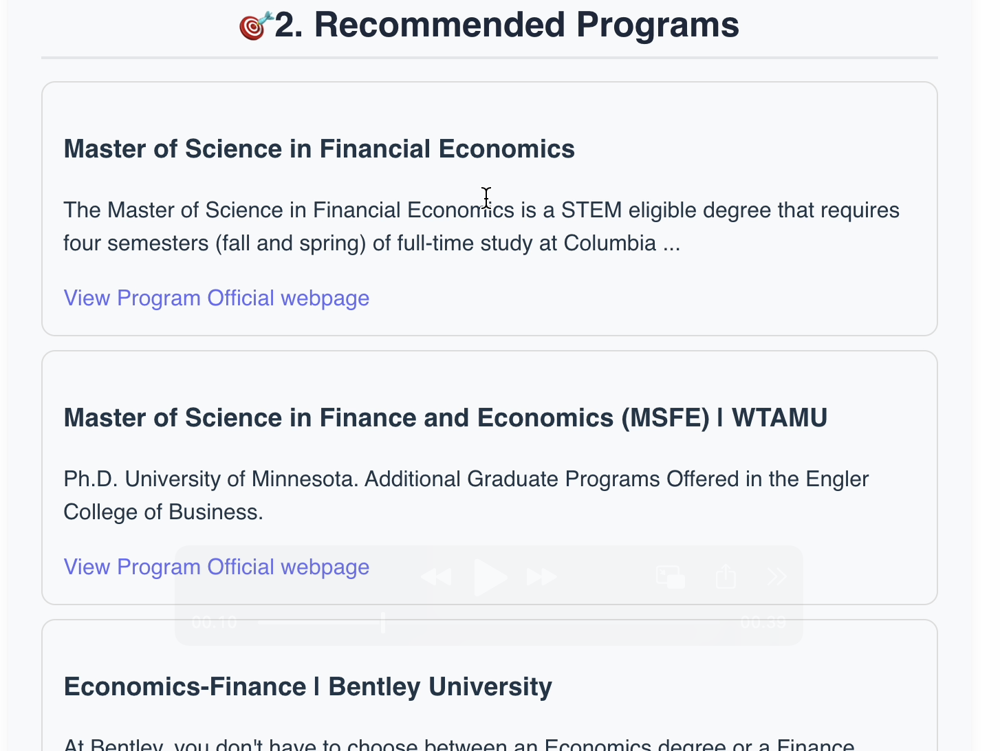

# 🧠 UniPath AI Agent

UniPath AI Agent is an intelligent academic guidance system that helps students analyze their resumes, match them with suitable graduate programs, and discover relevant professors — all powered by **LLMs (AWS Bedrock + Anthropic Claude)** and a **FastAPI + Vue.js** tech stack.





---

## 🚀 Features

### 🎓 Resume Analysis
- Upload your resume (PDF)
- Automatically extracts education, skills, research interests, and publications
- Summarizes key academic background in structured JSON

### 🎯 Program Recommendation
- Finds graduate programs that align with your field of study
- Displays program name, snippet, and direct application link

### 👩‍🏫 Faculty Matching
- Matches you with professors whose research interests align with your resume
- Fetches faculty names, titles, and research areas dynamically

### 📄 Requirement Parser
- Parses university program pages (via URL)
- Extracts key application requirements (GPA, GRE, deadlines, etc.)

### 📊 Progress Tracker *(optional extension)*
- Tracks application progress and stores user profiles via unique user IDs

---

## 🧰 Tech Stack

| Layer | Technology |
|-------|-------------|
| **Frontend** | Vue 3 + Vite |
| **Backend** | FastAPI (Python) |
| **AI Engine** | AWS Bedrock + Anthropic Claude 3.5 |
| **Data Extraction** | PyMuPDF, BeautifulSoup |
| **Storage** | AWS S3 |
| **Infra / Dev** | boto3, dotenv, requests, JSON pipelines |

---

## ⚙️ Project Setup
To test the UniPath AI demo:
(if you want to test it out before January 2026 online)

1️⃣ Go to the deployed site:
🔗 https://unipath-app.gentlewave-56158528.westus2.azurecontainerapps.io

2️⃣ Upload your resume (PDF).
The backend will analyze it using AWS Bedrock (Claude 3.5 Sonnet) and return personalized academic program recommendations.

⚠️ Important Notes:

If you see a “500 Internal Server Error”, don’t panic.
This usually means the AWS Bedrock Claude model is temporarily not responding or throttled — not a bug in this application.
Just wait a few seconds and retry.

All other routes (e.g. /recommend-programs, /faculty-match, /generate-tracker) are functional and handled via the FastAPI backend.

CORS and S3 access are properly configured; errors only occur if the Bedrock API times out.

to do it locally

### 1. Clone the repository
```bash
git clone https://github.com/LycheeeLu/UniPath-AI-Agent.git
cd UniPath-AI-Agent
```

### 2. Backend Setup

Create and activate a virtual environment:
```bash
conda create -n uniPath-env python=3.10
conda activate uniPath-env
pip install -r requirements.txt
```

### 3. Create .env in backend/:
```bash
AWS_ACCESS_KEY_ID=your_access_key
AWS_SECRET_ACCESS_KEY=your_secret_key
AWS_REGION=us-east-1(or ur selected aws region)
BEDROCK_MODEL_ID=arn:aws:bedrock:us-east-1:088068647130:inference-profile/global.anthropic.claude-sonnet-4-20250514-v1:0(or any other inference profile arn on https://us-east-1.console.aws.amazon.com/bedrock/home?region=us-east-1#/inference-profiles)
```

### 4. Run backend:
```bash
uvicorn backend.main:app --reload
```

Backend runs on:

http://127.0.0.1:8000

### 5. Frontend Setup

```bash
cd frontend
npm install
npm run dev
```

Frontend runs on:

http://localhost:5173


### 5. 🌐 demo video
[UniPath-AI-Agent usage demo_1](https://youtu.be/uu-9EwuvA-s)


### 6. 🧑‍💻 Development Notes

Backend is modularized by “agents” (resume, faculty, requirements, etc.)

Frontend uses composition API and reactive state (ref and fetch)

CORS is configured for localhost:5173

Bedrock calls are handled through boto3 using the bedrock-runtime client


Upload a resume PDF via the UploadView
Backend extracts content → sends it to Bedrock → returns structured summary
The frontend displays:
- Resume summary
- Recommended graduate programs
- Faculty matches (if available)
- Optionally, click on a program → parse its requirements in real time (checkout production branch)

